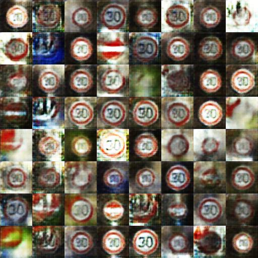
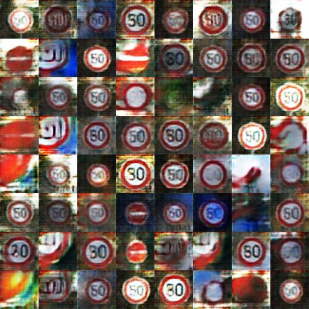
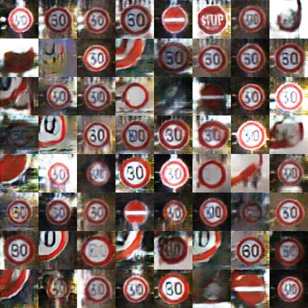
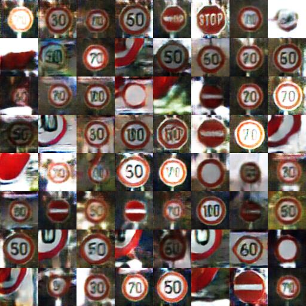

# GAN in Tensorflow for Traffic Sings

## Prerequisites

- Python 2.7 or Python 3.3+
- [Tensorflow 0.12.1](https://github.com/tensorflow/tensorflow/tree/r0.12)

## Dataset

GTSRB

## Results

After 6th epoch:

After 10th epoch:

After 17th epoch:

After 24th epoch:

Progress of training

Basic dataset             |  Blue Cirle dataset | Blue Circle with preprocessing 
:--------------------:|:--------------------:|:--------------------:
  |   | 
